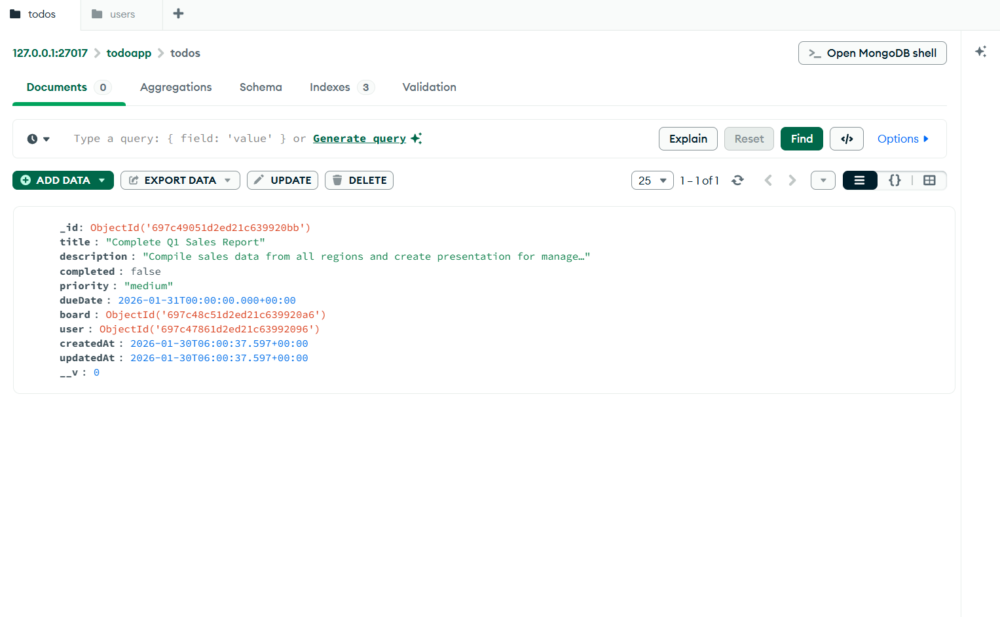
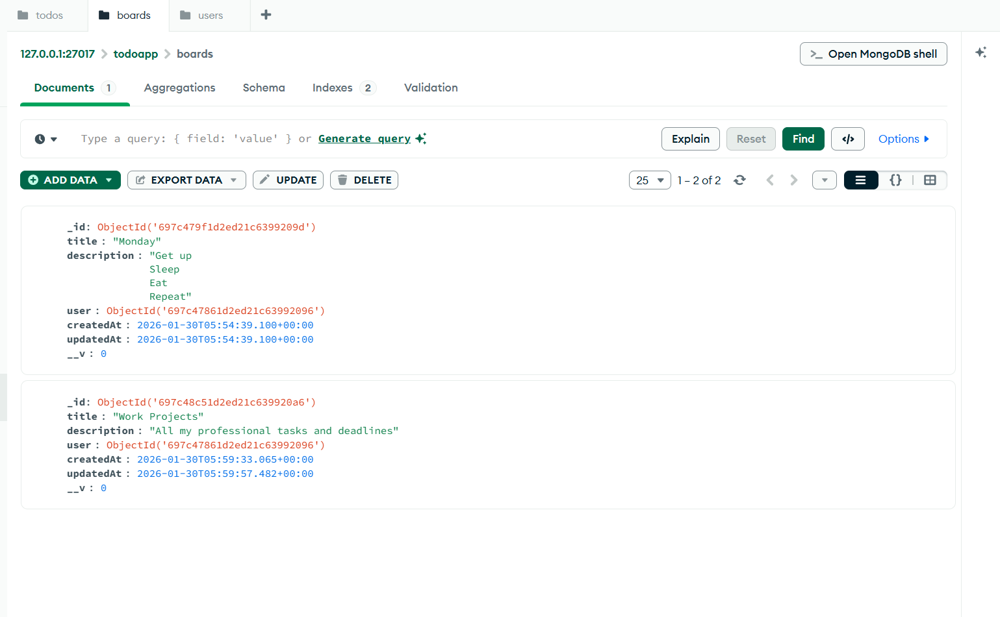
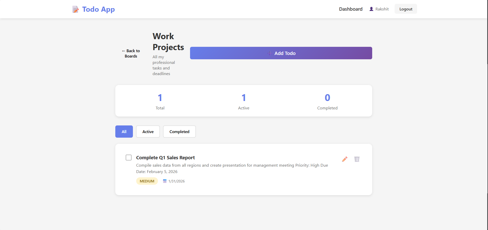
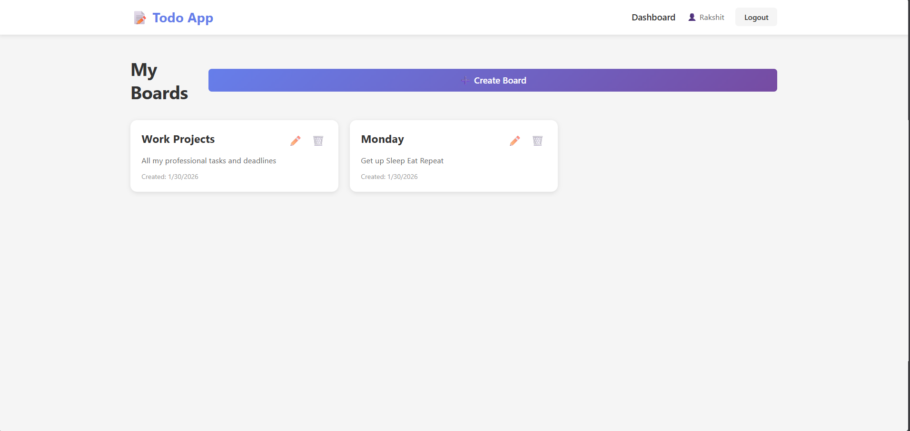
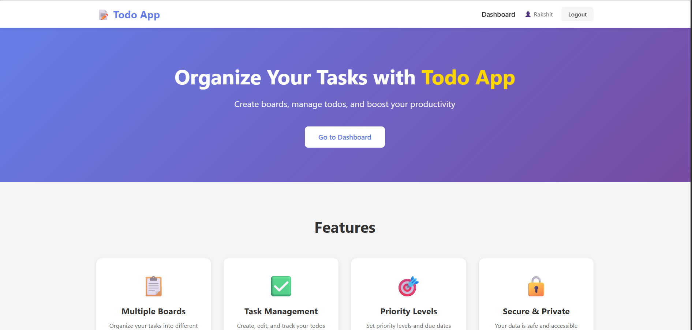
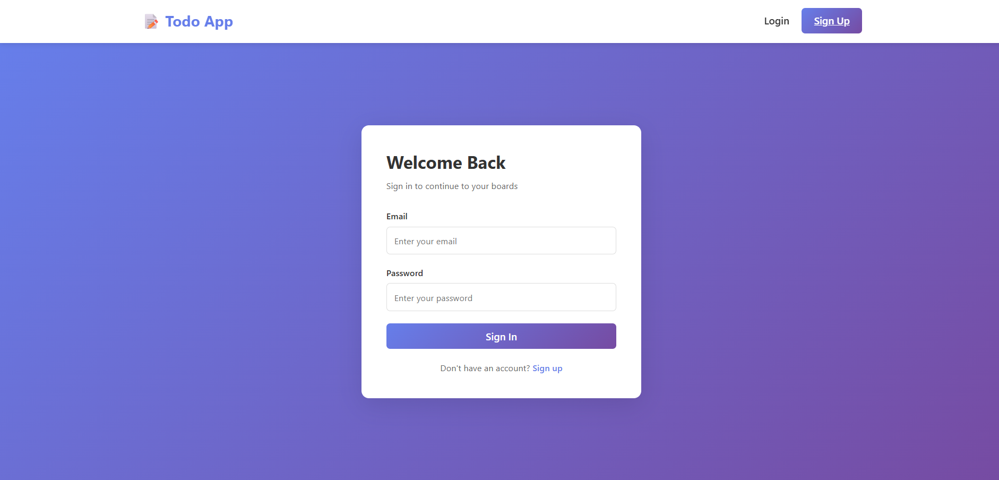

# To-Do Web Application

Full-stack task management application built with React, Node.js, Express, and MongoDB.

## 🎯 Project Overview

This application allows users to:

- Register and login with email authentication
- Create and manage multiple boards
- Add, edit, delete, and complete todos
- Filter todos by status
- Set priority levels and due dates

## 🛠️ Tech Stack

**Frontend:** React.js, React Router, Axios, Context API  
**Backend:** Node.js, Express.js, MongoDB, Mongoose, JWT

## 📁 Project Structure

```
todo-app/
├── backend/          # Express API (Port 4000)
├── frontend/         # React App (Port 3000)
└── screenshots/      # Application screenshots
```

## 🚀 Quick Start

### Backend

```bash
cd backend
npm install
npm run dev
```

### Frontend

```bash
cd frontend
npm install
npm start
```

See individual README files in `backend/` and `frontend/` folders for detailed setup instructions.

## 📸 Application Screenshots








## 📋 Features

- ✅ User authentication with JWT
- ✅ Board management (Create, Edit, Delete)
- ✅ Todo management with priorities
- ✅ Completion tracking and filtering
- ✅ Responsive design
- ✅ Modern UI with animations

## 📝 API Documentation

See [Backend README](backend/README.md) for complete API documentation.

## 🎨 Frontend Documentation

See [Frontend README](frontend/README.md) for component structure and setup.

## 👤 Author

Rakshit Maloo

## 📅 Submission Date

January 30, 2026

---

Built for placement assessment

```

---

## **✅ File Structure Should Be:**
```

todo-app/
├── screenshots/
│ ├── Screenshot 2026-01-30 113247.png
│ ├── Screenshot 2026-01-30 113337.png
│ ├── Screenshot 2026-01-30 113424.png
│ ├── Screenshot 2026-01-30 113456.png
│ ├── Screenshot 2026-01-30 113525.png
│ └── Screenshot 2026-01-30 113614.png
├── backend/
│ ├── src/
│ ├── README.md ← Backend API docs
│ └── ...
├── frontend/
│ ├── src/
│ ├── README.md ← Frontend component docs
│ └── ...
└── README.md ← Main overview + screenshots
